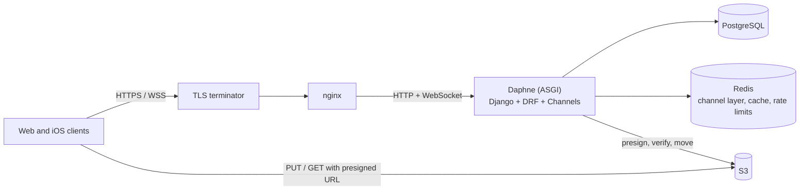

# Bravo backend

[](https://github.com/pinchiguillo/bravo-adapted/actions/workflows/ci.yml)

Backend for **Bravo** ([bravo-services.com](https://bravo-services.com)), a services
marketplace. Companies publish announcements with price tables, customers open job requests,
and both sides agree on a price in a real-time chat before the job starts.

Django 5.2 · Django REST Framework · Channels (WebSockets) · PostgreSQL 16 · Redis · S3 ·
Docker · GitHub Actions

- 166 REST operations across 9 Django apps, plus a WebSocket chat
- 415 tests (pytest, PostgreSQL in CI, S3/SES mocked with moto), 90% coverage enforced at 88%
- `ruff` (bugbear, bandit, simplify, Django rules), `mypy` on the core, OpenAPI schema validated with zero warnings, `pip-audit` on every push

## Architecture



| App | Responsibility |
|---|---|
| `auth` | Custom user, email verification, JWT sessions (rotation, revocation, lockout) |
| `organization` | Organizations, announcements, service catalog, price tables, availability, images, favorites |
| `jobs` | Job requests and their lifecycle |
| `job_chat` | Chat per job over REST and WebSocket, price proposals, attachments |
| `assets` | Presigned direct-to-S3 uploads with server-side verification |
| `notifications` | In-app inbox, email delivery, per-user preferences |
| `rgpd` | GDPR consents (signed-in and anonymous), policy versions, data-subject requests |
| `management` | Staff API for moderation and back-office |
| `statistics` | Daily platform and announcement statistics |

More detail in [docs/ARCHITECTURE.md](docs/ARCHITECTURE.md) and the WebSocket contract in
[docs/WEBSOCKETS.md](docs/WEBSOCKETS.md).

## Running it

Requirements: Docker with Compose v2.

```bash
docker compose up --build
```

The API is at <http://localhost:24356> (through nginx) with interactive docs at
<http://localhost:24356/api/docs/>. Compose starts PostgreSQL, Redis and LocalStack (S3/SES),
runs migrations in a one-shot `migrate` service, then starts the app. Every variable has a
development default; copy `example.env` to `.env` to override them.

```bash
docker compose exec app pytest                     # full test suite
docker compose exec app python manage.py seed_fixed_tables
docker compose exec -e SEED_USER_PASSWORD=<password> app python manage.py seed_custom_bulk
```

Without Docker (tests run on SQLite with S3/SES mocked):

```bash
python3.12 -m venv .venv && . .venv/bin/activate
pip install -r requirements-dev.txt
pytest
```

`compose.prod.yml` is the production-like stack: the non-root `prod` image, real S3, nginx bound
to localhost behind a TLS terminator, and secrets required at start-up.

## Design decisions

**Uploads go straight to S3, but are never trusted.** The API issues a presigned PUT to a
pending key. On completion it checks the object's size and content type against what the client
declared, sniffs magic bytes, runs Pillow's `verify()` on images, and only then copies the object
to its final key. Anything that fails is deleted. Large files never pass through the app servers.
([apps/assets/services.py](apps/assets/services.py))

**Price proposals are a small state machine owned by the server.** REST and WebSocket share one
service. A proposal is created as `pending` whatever the client sends; only the other participant
can answer it, and only once. The row is locked with `select_for_update`, and accepting a
proposal activates the job in the same transaction.
([apps/job_chat/services.py](apps/job_chat/services.py))

**Short-lived access, revocable sessions.** Access tokens live 15 minutes. Refresh tokens rotate
and the old one is blacklisted. Replaying a rotated-out token revokes every session of that user,
since one of the copies must be stolen. Sessions cannot be refreshed past 30 days, and there is a
log-out-everywhere endpoint. ([apps/auth/sessions.py](apps/auth/sessions.py))

**Rate limits key on the real client.** `X-Forwarded-For` is honoured only from configured
proxies and read right to left. IPv6 clients are grouped by /64. Failed logins are also counted
per account, so spreading attempts over many IPs does not help.
([common/client_ip.py](common/client_ip.py), [apps/auth/login_guard.py](apps/auth/login_guard.py))

**Money is `Decimal`, and the database enforces it.** Prices are `DecimalField`s with CHECK
constraints, and currencies are a fixed ISO 4217 list. Chat proposals are validated as two-decimal
amounts before they are stored.

**Deny by default.** A view is private unless it opts in to `AllowAny`. A test pins the exact set
of operations reachable anonymously, so a new public endpoint has to be added to that list on
purpose. ([Core/tests.py](Core/tests.py))

**Services do not speak HTTP.** Business rules raise `DomainError`s, which a DRF exception handler
maps to responses and the WebSocket consumer maps to error frames.
([common/exceptions.py](common/exceptions.py))

## Security hardening

Before publishing, I reviewed the code the way a security reviewer would. Every fix below comes
with a regression test that fails against the previous code.

| Issue | Fix | Regression test |
|---|---|---|
| Staff could make any user superuser, or reset a superuser's password and log in as them | Only superusers manage roles and privileged accounts; changes are judged by value, so a form PUT cannot demote silently | [`apps/management/tests.py`](apps/management/tests.py) `test_staff_cannot_take_over_a_superuser_account` |
| `BYPASS_ADMIN_LOGIN` switched the whole staff API to `AllowAny` | Removed; every `/api/management/` operation must answer 401/403 | `ManagementAccessControlTests` |
| 7-day access tokens, refresh tokens never revoked, no logout | 15-minute access, rotation with blacklist, reuse detection, logout and logout-all | [`apps/auth/tests.py`](apps/auth/tests.py) `test_replaying_a_rotated_refresh_token_ends_every_session` |
| Login throttle bypassed by rotating `X-Forwarded-For` or sending any valid token | Trusted-proxy IP resolution, public auth endpoints ignore auth headers, per-account lockout | `test_login_throttle_cannot_be_bypassed_by_rotating_forwarded_for` |
| Chat clients could forge accepted proposals, negative prices, or accept their own | Validated widgets, server-owned status, row lock, 409 on a second answer | [`apps/job_chat/tests.py`](apps/job_chat/tests.py) `ProposalWidgetTests` |
| Jobs created as `completed`, rated, or priced with another announcement's price | Writable fields restricted; transitions per role; DB constraint on ratings | [`apps/jobs/tests.py`](apps/jobs/tests.py) `test_new_jobs_start_pending_whatever_the_client_sends` |
| Any user could host HTML or SVG on the media origin | Public uploads limited to JPEG, PNG and PDF; privileged asset kinds restricted | [`apps/assets/tests.py`](apps/assets/tests.py) `test_active_content_types_are_rejected_for_public_uploads` |
| WebSocket: no origin check, unenforced rate limit, sockets never re-validated | Origin allow-list, atomic per-user limit, token expiry and account checks on every frame | [`apps/job_chat/tests_websocket.py`](apps/job_chat/tests_websocket.py) |
| Presigned URLs rebuilt on another host, which breaks SigV4 against real S3 | Presigned URLs returned as signed outside the development proxy | `PublicMediaUrlTests` |
| `/api/notifications/*` always returned 500 (undefined throttle scopes) | Scopes defined; a test checks every routed view's scopes | `ThrottleScopeConfigurationTests` |
| `DEBUG` and password rules could be disabled in production | Forced in production; 12-character minimum | [`apps/management/tests_security_settings.py`](apps/management/tests_security_settings.py) |
| Known CVEs in Django, DRF, Daphne and Pillow | Upgraded; `pip-audit` runs in CI | CI `audit` job |

## Known limitations

- Notifications (in-app and email) are sent inside the request. A slow mail provider slows the
  request. The next step is a transactional outbox drained by a worker.
- The current web client still sends its WebSocket token as `?token=`. That is accepted behind
  `JOB_CHAT_WS_ALLOW_QUERY_TOKEN`, and nginx logs paths without query strings. New clients should
  use the `bearer` subprotocol.
- Refresh-token reuse detection logs a user out everywhere if two tabs refresh with the same
  token at the same time. Clients should serialise refreshes.
- `unread_count` in the job list is always 0: read receipts are not implemented.
- Statistics are rebuilt by management commands, not streamed.
- User-facing strings are in Spanish (the product targets Spain) and are not translated.
- `mypy` covers the core modules (`common`, assets, sessions, chat services); the rest is being
  added module by module.

## Context

Bravo is an early-stage startup I built with acquaintances. I wrote this backend between March and
May 2026 in the team's private repository, then hardened and published it here. The commit history
is preserved, with credentials and deployment details removed. AI coding assistants were used
during development.

## License

Copyright © 2026 Javier Aguado Abajo. All rights reserved. The code is published so it can be read
and evaluated; it may not be used, copied or redistributed without permission. See
[LICENSE](LICENSE).
