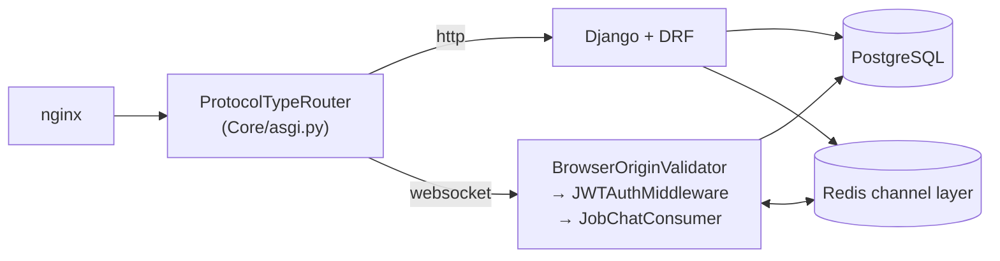
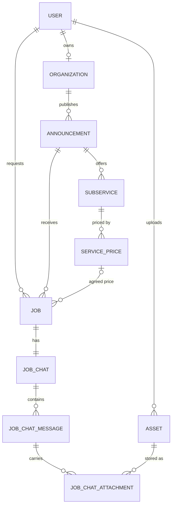
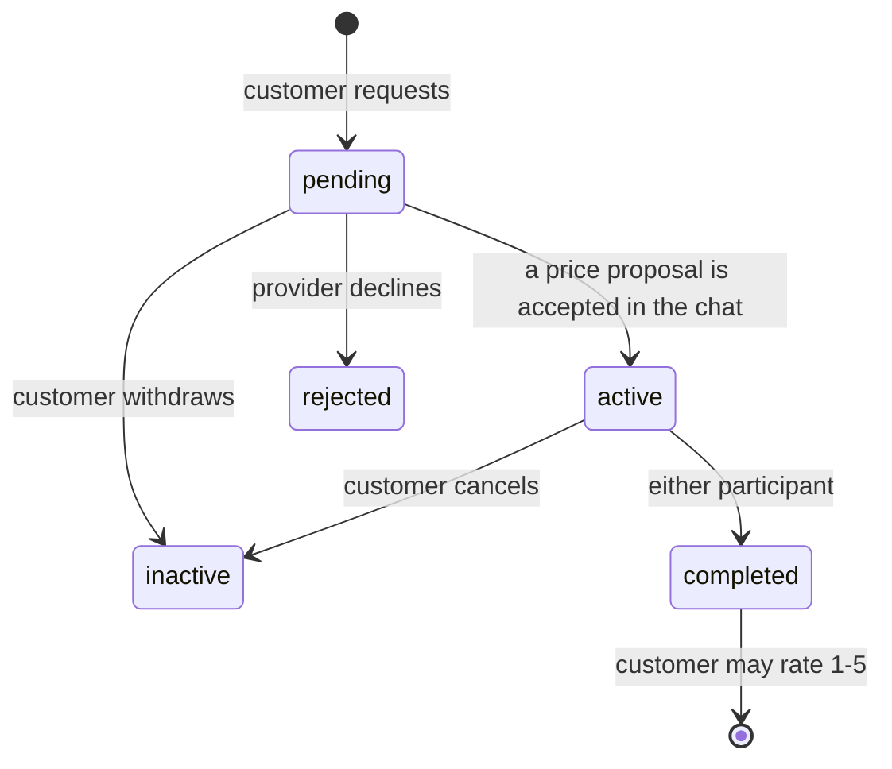
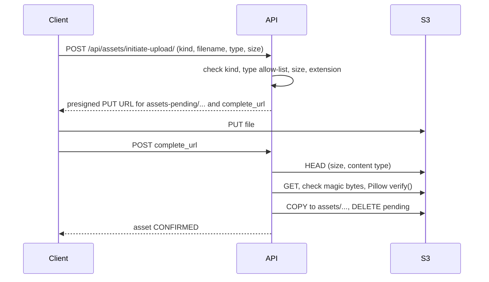

# Architecture

## Runtime

One ASGI process (Daphne) serves both the REST API and the WebSocket chat:

- **PostgreSQL** holds all state. SQLite is only used by local test runs.
- **Redis** is the Channels layer (chat fan-out across processes) and the Django cache, so rate
  limit counters are shared by every worker.
- **S3** stores files. Clients upload and download with presigned URLs; the API only signs,
  verifies and moves objects.
- `APP_MODE=production` turns development conveniences off and refuses to start without the
  required secrets (`Core/settings.py`).

## Domain model

A **job** is a customer's request on an announcement. Its life cycle:

Staff can set any status from the management API.

## Request pipeline (REST)

1. **Authentication**: `JWTAuthentication`. The public auth endpoints (login, refresh, logout,
   register, verify-email) do not authenticate, so a stale `Authorization` header cannot break them.
2. **Permissions**: `IsActiveAccount` by default (authenticated, active and not suspended). Public
   endpoints opt in with `AllowAny`; staff endpoints add `IsAdminUser`.
3. **Throttling**: `ClientIPScopedRateThrottle` with a scope per action (`common/throttling.py`).
   Anonymous callers are keyed by the client IP that `common/client_ip.py` resolves from
   `TRUSTED_PROXY_IPS` (IPv6 grouped by /64); authenticated callers by user id.
4. **Views and serializers** validate input; **services** hold business rules that span models
   and raise `common.exceptions.DomainError` subclasses, which
   `common.exception_handler.exception_handler` turns into responses.

## Upload pipeline

Rejected uploads are deleted from the pending prefix. Confirmation locks the asset row, so two
concurrent confirmations cannot both move the object.

## Sessions

- Access token: 15 minutes. Refresh token: 7 days, rotated on every use, previous one blacklisted.
- `auth_time` survives rotation; refreshing stops working 30 days after login.
- Replaying a blacklisted refresh token revokes every refresh token of the user.
- `POST /api/auth/logout-all/` and an admin password reset revoke all sessions.
- Failed logins are limited per IP and per account (`apps/auth/login_guard.py`).

## Testing

- `pytest` with `pytest-django`; settings in `Core/settings_test.py`.
- `conftest.py` mocks S3 and SES with moto for the whole session and clears caches before each
  test, so throttling state never leaks between tests.
- CI runs the suite on PostgreSQL 16, where `select_for_update` and CHECK constraints are real.
