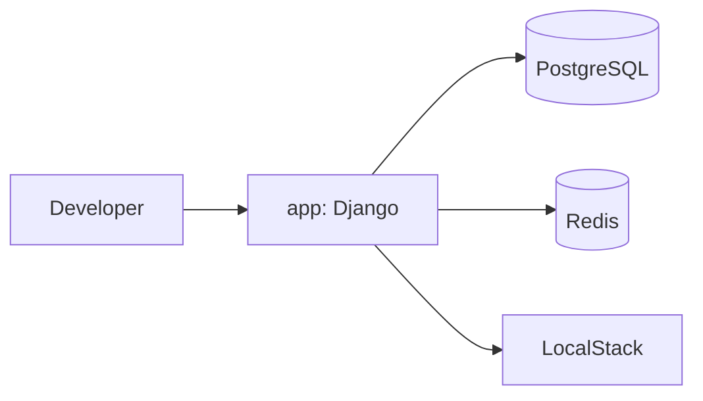

# Arquitectura del Proyecto

## Visión general

El repositorio contiene un backend Django/DRF/Channels (`Core`) y definiciones Docker Compose para desarrollo y ejecución productiva básica.

## Componentes

### 1. Backend (`app`)

- Runtime: `python:3.12-slim`
- Framework: Django (proyecto `Core`)
- Punto de entrada del contenedor: `entrypoint.sh`
- Comando final de ejecución:
  - desarrollo: `python manage.py runserver 0.0.0.0:8000`
  - producción: `daphne -b 0.0.0.0 -p <PORT> Core.asgi:application`

Responsabilidades:

- Ejecutar migraciones antes de levantar el proceso de servidor.
- Cargar configuración desde variables de entorno.
- Exponer puerto `8000`.
- Servir HTTP, DRF y WebSockets.

### 2. Base de datos (`postgres`)

- Imagen: `postgres:16-alpine`
- Base de datos por defecto: `auth_db`
- Usuario: `postgres`
- Puerto interno: `5432` (no publicado al host)
- Persistencia: volumen Docker `postgres_data`

### 3. Redis (`redis`, en `compose.prod.yml`)

- Imagen: `redis:7-alpine`
- Rol: channel layer para fan-out de websockets en producción
- Conexión: `REDIS_URL`

### 4. Servicios AWS locales (`localstack`)

- Imagen: `localstack/localstack:latest`
- Servicios habilitados: `s3`, `sqs`, `sns`, `ses`
- Endpoint principal: `http://localhost:4566`
- Persistencia: volumen Docker `localstack_data`
- Bootstrap de recursos en arranque:
  - Bucket S3 (`AWS_STORAGE_BUCKET_NAME`)
  - Identidad SES verificada (`DEFAULT_FROM_EMAIL`)

## Diagrama de alto nivel

## Estado actual de configuración

- `Core/settings.py` lee configuración desde entorno (`.env`) y aplica validaciones fail-fast en `APP_MODE=production`.
- `compose.yml` y `compose.prod.yml` cargan `backend/.env`.
- En producción se fuerzan flags de seguridad y se exige configuración obligatoria (`SECRET_KEY`, `ALLOWED_HOSTS`, `DATABASE_URL`, `REDIS_URL`, etc).

Implicación:

- En Docker Compose, Django usa PostgreSQL por `DATABASE_URL`.
- En producción se endurecen flags de seguridad y `check --deploy` queda limpio con configuración productiva.
- Fuera de Docker, sin `DATABASE_URL`, mantiene fallback SQLite para desarrollo.

## Decisiones técnicas vigentes

- El código se monta por volumen (`.:/app`), evitando copiar fuentes en build.
- La inicialización se centraliza en `entrypoint.sh` para mantener `compose.yml` limpio.
- El middleware WebSocket JWT mantiene token por querystring por compatibilidad, con logging estructurado y manejo explícito de errores.
- El pipeline CI ejecuta `ruff` sobre el codigo del proyecto, tests y `check --deploy` usando Docker Compose.
